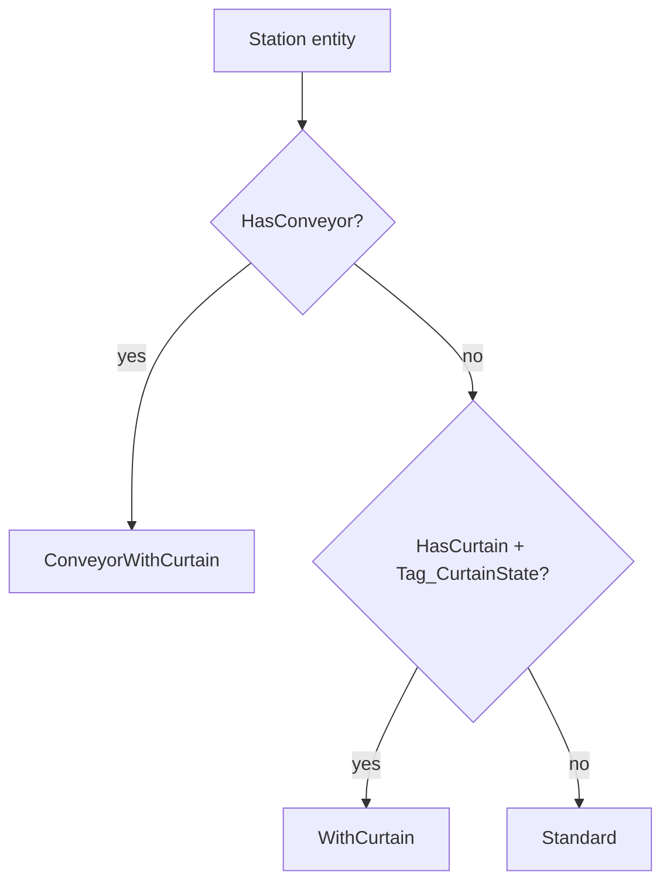
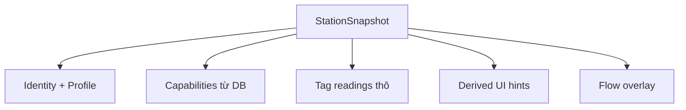
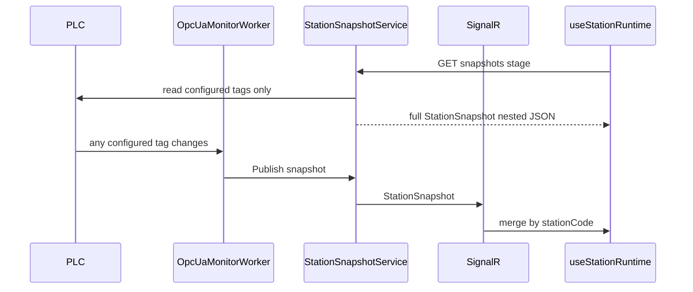

# Refactor Main + StationSnapshot (profile-aware)

> Kế hoạch refactor màn Main (`Wcs.CmsFE`) và kiến trúc `StationSnapshot` backend.  
> Cập nhật: 2026-07-01

## Tổng quan

Refactor Main + StationSnapshot: BE derive trạng thái theo 3 profile tag station (thường / có rèm / băng tải+rèm), push SignalR; FE merge snapshot; UI rèm/băng tải phase sau.

## Checklist triển khai

- [ ] **be-snapshot-model** — `Wcs.Common`: StationSnapshot đầy đủ (config + tags + derived UI hints: curtain, conveyor, tray, flow) + `StationSnapshotChanged`
- [ ] **be-opc-read-extend** — `Wcs.Api`: mở rộng `GetStationOpcTagsAsync` (+ `Tag_Control`); `OpcUaMonitorWorker` subscribe thêm QRCode, ConveyorNumber, Control
- [ ] **be-snapshot-service** — `Wcs.Api`: `StationSnapshotService` — detect profile, `DeriveSensorState`, `DeriveConveyorCapacity` (max 5, canAcceptDrop), flow overlay
- [ ] **be-snapshot-publish** — `Wcs.Api`: `StationSnapshotPublisher` — refresh khi bất kỳ configured tag của station đổi
- [ ] **be-snapshot-api** — `Wcs.Api`: `GET /api/stations/snapshots?stageCode=` và `GET /api/stations/{code}/snapshot`
- [ ] **cms-signalr** — `Wcs.Cms`: `AllEventHandler` CapSubscribe `StationSnapshotChanged` → SignalR `StationSnapshot`
- [ ] **fe-snapshot-service** — `Wcs.CmsFE`: types mirror nested snapshot + `mapStationSnapshot` (gắn `TStation.snapshot` đầy đủ)
- [ ] **use-station-runtime** — `useStationRuntime`: GET snapshots + on `StationSnapshot`; bỏ OPC merge thủ công trên FE
- [ ] **extract-panels** — Tách `StationGrid`, `ProductInfoPanel`, `TransferActionPanel` từ `Index.tsx`
- [ ] **slim-index** — Rút gọn `Index.tsx`, dọn dead code
- [ ] **phase2-equipment-ui** — PHASE SAU: UI badge rèm, băng tải, control trên Okidai/StationGrid

---

## Nguyên tắc thiết kế

**Không phải station nào cũng có `Tag_HasCassette`.** Snapshot phải:

1. Đọc **chỉ các tag được cấu hình** trên entity [`Station`](../src/Wcs.Common/Entities/Station.cs) (null = không có).
2. Phân loại **profile** để derive “có hàng / không có hàng” (`SensorState`) đúng nguồn.
3. Lưu **đủ lớp dữ liệu** để UI sau chỉ render, không parse OPC:
   - **Config** — station có tag/thiết bị gì (từ DB)
   - **Tags** — giá trị thô + `opcGood` từng tag (null = không cấu hình)
   - **Derived / UI hints** — boolean & số đã tính sẵn (rèm mở/đóng, `3/5` băng tải, …)
4. Đồng bộ enum với [`ValueObjects/Station.cs`](../src/Wcs.Common/ValueObjects/Station.cs).

---

## Ba profile tag (theo mô tả nghiệp vụ)

| Profile | Điều kiện detect | Tags OPC (chỉ đọc nếu configured) |
|---------|-------------------|-----------------------------------|
| **Standard** | `!HasConveyor` và không có rèm (`!HasCurtain` hoặc không có `Tag_CurtainState`) | `Tag_HasCassette`, `Tag_QRCode` |
| **WithCurtain** | `!HasConveyor` và có rèm | `Tag_HasCassette`, `Tag_QRCode`, `Tag_CurtainState`, `Tag_Control` |
| **ConveyorWithCurtain** | `HasConveyor` (thường kèm rèm) | `Tag_CurtainState`, `Tag_QRCode`, `Tag_Control`, `Tag_ConveyorState`, `Tag_ConveyorNumber` *(optional)* — **không có `Tag_HasCassette`** |



**Ghi chú `Tag_Control`:** PC → PLC (điều khiển xâm nhập). Snapshot **đọc** giá trị hiện tại (`StationControl` enum) để phase sau hiển thị; không thay thế luồng ghi OPC hiện có.

**`Tag_Status`:** có trên một số config ([`station.json`](../config/station.json)) nhưng chưa nằm trong 3 profile UI — **không đưa vào snapshot phase này** (có thể bổ sung sau).

---

## Enum tag (nguồn truth)

Từ [`src/Wcs.Common/ValueObjects/Station.cs`](../src/Wcs.Common/ValueObjects/Station.cs):

| Enum | Giá trị | Tag |
|------|---------|-----|
| `StationHasCassette` | `0` NoExist, `1` Exist | `Tag_HasCassette` |
| `CurtainState` | `0` IntrusionProhibited (rèm đóng), `1` IntrusionPossible (rèm mở) | `Tag_CurtainState` |
| `StationControl` | `0` Idle, `1` IntrusionRequest, `2` IntrusionInProgress | `Tag_Control` |
| `ConveyorStage` | `1` Empty, `2` HasRequestPickup, `3` HasCassette | `Tag_ConveyorState` |
| `ConveyorNumber` | `int` 0…5 | `Tag_ConveyorNumber` — **optional**; số hàng đang trên băng tải (max **5**) |

### Quy tắc `ConveyorNumber` (nghiệp vụ)

- Giá trị hợp lệ: **0 → 5** (max capacity = 5).
- **`ConveyorNumber < 5`** → băng tải **còn chỗ**, **có thể nhận hàng** (drop).
- **`ConveyorNumber >= 5`** → băng tải **đầy**, **không thể nhận hàng**.
- Station **có thể không có** `Tag_ConveyorNumber` → mọi derive liên quan capacity trả **`null`** (không đoán).

Khớp logic hiện có trong [`StationService`](../src/Wcs.Api/Services/StationService.cs):

- `GetHasCassetteStationByStageAndSize`: `ConveyorNumber > 0` mới lấy hàng
- `GetEmptyStationByStageAndSize` / `IsStationAvailableForDropAsync`: `ConveyorNumber >= 5` → không thả hàng
- `GetWaitingRequirements` BeforeDrop: `>= 5` → chờ `ConveyorRemainingSpace`

**Tách hai khái niệm** (không trộn):

| Khái niệm | Mục đích | Nguồn |
|-----------|----------|--------|
| **`SensorState`** (Okidai xanh/xám) | Có hàng trên băng để hiển thị / pick | Ưu tiên `ConveyorStage`; fallback `ConveyorNumber > 0` |
| **`CanAcceptDrop`** (derive) | Còn nhận hàng được không | Chỉ khi có tag: `ConveyorNumber < 5` |

Khi **không có** `Tag_ConveyorNumber`, `CanAcceptDrop = null`; kiểm tra drop fallback có thể dựa `ConveyorStage == Empty` (giống `BeforeDrop` trong `GetWaitingRequirements`) — phase UI sau.

---

## Derive `SensorState` (có hàng / không / mất kết nối)

Logic **port từ** [`StationService`](../src/Wcs.Api/Services/StationService.cs) (`GetHasCassetteStationByStageAndSize`, `GetWaitingRequirements`, `IsStationAvailableForDropAsync`):

### Profile Standard / WithCurtain

- Có `Tag_HasCassette`:
  - OPC good + value `Exist` (1) → `HasCassette`
  - OPC good + value `NoExist` (0) → `NoCassette`
  - OPC bad / không đọc được → `Disconnect`
- Không có tag → `Disconnect` (không suy đoán)

### Profile ConveyorWithCurtain

**Không dùng `Tag_HasCassette`.** Suy “có hàng trên băng” (`SensorState`):

1. Nếu có `Tag_ConveyorState` và OPC good:
   - `ConveyorStage.HasCassette` (3) → `HasCassette`
   - `Empty` (1) hoặc `HasRequestPickup` (2) → `NoCassette` *(phase UI sau: badge trung gian riêng)*
2. **Chỉ khi không có `ConveyorState` hoặc OPC bad**, fallback `Tag_ConveyorNumber`:
   - `count > 0` → `HasCassette`
   - `count == 0` → `NoCassette`
3. Không đủ tag đọc được → `Disconnect`

### Derive `CanAcceptDrop` (chỉ profile băng tải)

```csharp
const int ConveyorCapacityMax = 5;

bool? DeriveCanAcceptDrop(int? conveyorNumber, bool? numberOpcGood) {
  if (conveyorNumber is null || numberOpcGood != true)
    return null;
  return conveyorNumber < ConveyorCapacityMax;  // 0..4 → true, 5 → false
}
```

### `DisplayState`

`SensorState` + overlay flow:

- from station, active task, step < `AfterPickup` (6) → `Exporting`
- to station, active task, step < `BackToDropWaitingPoint` (11) → `Receiving`
- `!station.IsActive` → `Inactive`

---

## Model — snapshot đủ thông tin cho UI tương lai

File mới: [`src/Wcs.Common/Events/StationSnapshotEvents.cs`](../src/Wcs.Common/Events/StationSnapshotEvents.cs)

### Cấu trúc 4 lớp



### Ví dụ UI phase sau ← field snapshot

| UI muốn hiển thị | Field dùng |
|-------------------|------------|
| “Rèm đang **mở**” / “**đóng**” | `curtain.isOpen` / `curtain.isClosed` (hoặc `curtain.state`) |
| “Băng tải: **3/5**” | `conveyor.itemCount` + `conveyor.capacityMax` |
| “Băng tải **đầy**” | `conveyor.isFull` hoặc `conveyor.canAcceptDrop == false` |
| “Còn **nhận hàng**” | `conveyor.canAcceptDrop == true` |
| Trạng thái băng (Empty / chờ lấy / có khay) | `conveyor.stage` (`ConveyorStage`) |
| Có khay trên bệ (sensor) | `tray.hasCassette` hoặc `sensorState` |
| Mã khay QR | `tray.qrCode` |
| Điều khiển xâm nhập (Idle / Request / InProgress) | `control.state` |
| Màu Okidai xuất/nhận khay | `displayState` |

Nếu station **không có** tag → nhóm đó `isConfigured: false`, value `null` → UI **ẩn** widget tương ứng.

### Code model (đề xuất)

```csharp
public enum StationTagProfile { Standard, WithCurtain, ConveyorWithCurtain }
public enum StationDisplayState { NoCassette, HasCassette, Exporting, Receiving, Disconnect, Inactive }

public record StationSnapshotCapabilities(
  bool HasHasCassetteTag,
  bool HasQrcodeTag,
  bool HasCurtainTag,
  bool HasControlTag,
  bool HasConveyorStateTag,
  bool HasConveyorNumberTag
);

public record StationTraySnapshot(
  bool IsConfigured,
  bool? OpcGood,
  StationHasCassette? HasCassette,
  string? QrCode
);

public record StationCurtainSnapshot(
  bool IsConfigured,
  bool? OpcGood,
  CurtainState? State,
  bool? IsOpen,
  bool? IsClosed
);

public record StationControlSnapshot(
  bool IsConfigured,
  bool? OpcGood,
  StationControl? State
);

public record StationConveyorSnapshot(
  bool IsConfigured,
  bool? StageOpcGood,
  ConveyorStage? Stage,
  bool? NumberOpcGood,
  int? ItemCount,
  int CapacityMax,
  bool? CanAcceptDrop,
  bool? IsFull,
  bool? HasItemsOnBelt
);

public record StationFlowSnapshot(
  string? ActiveTaskId,
  int? CurrentStep
);

public record StationSnapshot(
  string StationCode,
  string StageCode,
  StationTagProfile Profile,
  bool IsActive,
  StationSnapshotCapabilities Capabilities,
  StationTraySnapshot Tray,
  StationCurtainSnapshot Curtain,
  StationControlSnapshot Control,
  StationConveyorSnapshot Conveyor,
  StationDisplayState SensorState,
  StationDisplayState DisplayState,
  StationFlowSnapshot Flow,
  DateTime UpdatedAt
);

public static class ConveyorConstants { public const int CapacityMax = 5; }
public record StationSnapshotChanged(StationSnapshot Snapshot);
```

---

## Backend — `StationSnapshotService`

### Detect profile

```csharp
static StationTagProfile DetectProfile(Station s) =>
  s.HasConveyor ? StationTagProfile.ConveyorWithCurtain
  : (s.HasCurtain && !string.IsNullOrEmpty(s.Tag_CurtainState))
    ? StationTagProfile.WithCurtain
    : StationTagProfile.Standard;
```

### `BuildAsync(stationCode)`

1. Load station từ DB
2. `DetectProfile` + build `Capabilities`
3. `GetStationOpcTagsAsync` → populate `Tray`, `Curtain`, `Control`, `Conveyor` (+ derive hints)
4. `DeriveSensorState(profile, tray, conveyor)`
5. Load active task → `DeriveDisplayState` + `Flow`
6. Return `StationSnapshot`

### `OpcUaMonitorWorker` — bổ sung subscribe

Per station (nếu configured): `Tag_QRCode`, `Tag_ConveyorNumber`, `Tag_Control`.

### `StationSnapshotPublisher`

Refresh khi bất kỳ configured tag đổi, hoặc flow events (from/to station).

---

## API + SignalR

```
GET /api/stations/snapshots?stageCode={stage}
GET /api/stations/{code}/snapshot
```

[`AllEventHandler.cs`](../src/Wcs.Cms/EventHandlers/AllEventHandler.cs): `StationSnapshotChanged` → SignalR `"StationSnapshot"`.

---

## Frontend

- Types: [`station-snapshot.ts`](../src/Wcs.CmsFE/src/types/station-snapshot.ts) — mirror nested BE
- `TStation.snapshot?: TStationSnapshot` — object đầy đủ, cập nhật mỗi SignalR push
- Phase này: Okidai dùng `snapshot.displayState`
- Phase sau: UI đọc `snapshot.curtain` / `snapshot.conveyor` — không đổi contract

---

## Luồng tổng thể



---

## Test checklist

**Khay / flow (Okidai):**

- Vào stage → `displayState` đúng trên cả 3 profile
- Flow → Exporting/Receiving → clear khi complete

**Snapshot đủ field (JSON):**

- **Standard:** `tray.hasCassette` có; `curtain.isConfigured=false`
- **WithCurtain:** `curtain.state`, `curtain.isOpen`/`isClosed`, `control.state`
- **ConveyorWithCurtain:** `tray.hasCassette` absent; `conveyor.stage`, `conveyor.itemCount` (nếu có tag)
- `conveyor.itemCount=4` → `canAcceptDrop=true`, `isFull=false`; `=5` → ngược lại
- Không có `Tag_ConveyorNumber` → các field number null, `isConfigured` false
- Đổi rèm PLC → `curtain.isOpen` đổi qua SignalR

---

## Phạm vi KHÔNG làm (lần này)

- UI badge rèm/băng tải/control
- `Tag_Status` trong snapshot
- Refactor transfer mutations; `Wms.FE`

---

## Rủi ro

| Rủi ro | Giảm thiểu |
|--------|-------------|
| Profile detect sai nếu DB flag lệch tag | Detect kết hợp `HasConveyor` + presence tag string |
| Conveyor `HasRequestPickup` hiển thị xám | `NoCassette` tạm; phase 2 badge trung gian |
| Nhầm `SensorState` với `CanAcceptDrop` | Snapshot tách field; tên rõ trên FE |
| `ConveyorNumber` > 5 từ PLC | Clamp/log warning; `canAcceptDrop = false` |
| Worker chưa subscribe QR/Control/ConveyorNumber | `be-opc-read-extend` bắt buộc trước test realtime |
